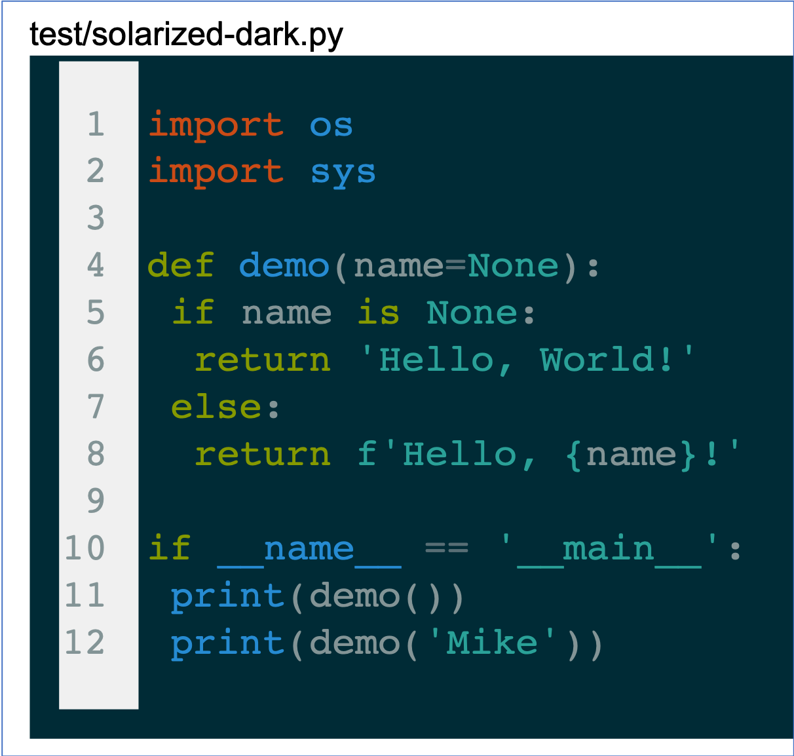

### PDFCode

Save code files into PDF format with syntax highlighting. 

It can convert a single code file or all files in a project (folder) using one command. 

___

### 1. Installation

1. Install libraries
``` bash
> pip install pygments
> pip install pdfkit
> pip install file-magic
```

#### MacOS:
``` Bash
########################################
# install wkhtmltopdf
> brew install caskroom/cask/wkhtmltopdf
# or
# brew cask reinstall wkhtmltopdf
########################################


########################################
# install libmagic
> brew install libmagic
########################################
```

___

### 2. Usage
Open a terminal and type the following command:
``` bash
> pdfcode --help 

# usage: pdfcode [-h] [--src SRC] [--dst [DST]] [-l] [-s SIZE] [-S NAME]
#                    [-m MARGIN] [-v]
#
# Convert source files into .pdf with syntax highlighting
#
# optional arguments:
#  -h, --help            show this help message and exit
#  --src SRC             the path of the file/folder
#  --dst [DST]           the path of the saving target folder. Empty will save
#                        to PDFCode_Results/
#  -l, --linenos         include line numbers.
#  -s SIZE, --size SIZE  PDF size. Letter,A1,A2,A3,A4,A5 etc
#  -S NAME, --style NAME
#                        the style name for highlighting.
#  -m MARGIN, --margin MARGIN
#                        the layout margins in inch (default 0.4in).
#  -v, --version         show program's version number and exit
```

Example 
``` Bash
# process single file:
> pdfcode --src ./test/algol.py -s a4 -S colorful 

# process all files in a folder and its subfolders:
> pdfcode --src ./test -s a4 -S colorful 
```

Now, the code supports 36 styles:

|abap|algol|algol_nu|arduino|autumn|borland|
|:---:|:---:|:---:|:---:|:---:|:---:|
|||||||
|bw|colorful|default|emacs|friendly|fruity|
|||||||
|igor|inkpot|lovelace|manni|monokai|murphy|
|||||||
|native|paraiso-dark|paraiso-light|pastie|perldoc|rainbow_dash|
|||||||
|rrt|sas|solarized-dark|solarized-light|stata|stata-dark|
|||||||
|stata-light|tango|trac|vim|vs|xcode|
|||||||

___

### 3. Acknowledgements
- This code is modified from [code2pdf](https://pypi.org/project/Code2pdf/). I am holding this repository because the [code2pdf](https://pypi.org/project/Code2pdf/) had the following problems at the moment when I was trying to use.
    1. The generated PDF files did not have syntax highlighting (all black-white).
    2. The command only supported to process a single file. Sometime, I want to process multiple code files.
    3. The **code2pdf** used python2 and pyqt4. They were not easy to setup on my machine (especially pyqt4).
- This code is implemented based on libraries like pdfkit, magic, pygments, etc.
I appreciate the contributations of all of these authors.

___

